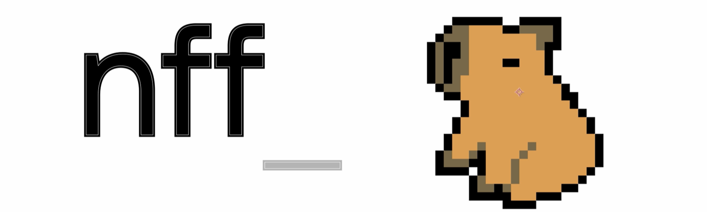
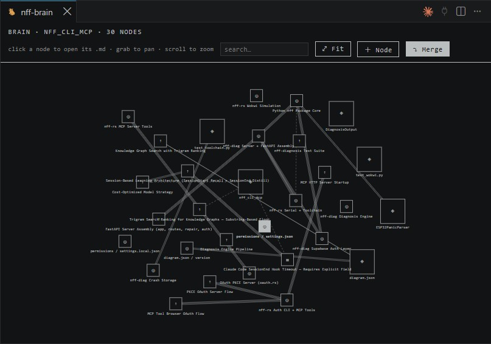

<p align="center">
  
</p>

# nff-brain, save tokens by picking the right LLM for the right task

**Coding agents burn too much tokens, switch models dynamically for the right tasks so you stay under your limits.**

<p>
  <a href="LICENSE"></a>
  <a href="https://github.com/GLechevalier/nff-brain/actions/workflows/ci.yml"></a>
  
</p>

`nff-brain` replaces flat `CLAUDE.md` memory with a knowledge graph that lives on your
machine as a plain JSON file, grown automatically through two Claude Code hooks.

- **Recalled automatically** — a `SessionStart` hook injects the relevant subgraph into
  every session's context. Pure-local, instant, fail-open.
- **Distilled automatically** — a `SessionEnd` hook turns what the session learned into
  new or refined nodes with one small `claude -p` call. Fail-open.
- **Visual & editable** — a VS Code extension renders the brain as an interactive graph
  (pannable canvas, memory document beside it) where you can edit, delete, link, and
  reinforce nodes by hand.
- **Local only.** The brain is a JSON file (`.nff-brain/brain.json`). Nothing is hosted,
  nothing leaves your machine, and the VS Code UI is bundled and fully offline.
- **No API key.** Distillation rides your existing `claude` CLI login — no separate
  credential to manage.
- **Cost-aware.** Distillation defaults to the cheapest model that handles the job
  (`haiku`), overridable per call or globally.

## Install

**npm**

```sh
npm install -g nff-brain
```

**curl (macOS/Linux)**

```sh
curl -fsSL https://raw.githubusercontent.com/GLechevalier/nff-brain/main/install.sh | sh
```

**PowerShell (Windows)**

```powershell
irm https://raw.githubusercontent.com/GLechevalier/nff-brain/main/install.ps1 | iex
```

**VS Code extension** — install “nff-brain” from the Marketplace (or grab the
`.vsix` from a GitHub release and `code --install-extension nff-brain-*.vsix`).

### Upgrade

```sh
nff-brain upgrade          # wraps: npm install -g nff-brain@latest
```

or just re-run any install command above — `npm install -g` is
install-or-upgrade. Check what you have with `nff-brain --version`.

## Quick start

```sh
cd your-project
nff-brain init --hooks
```

`init` creates `.nff-brain/brain.json` with a project hub node and — if a
`CLAUDE.md` / `AGENTS.md` exists — splits it into graph nodes with one
`claude -p` call. `--hooks` wires two hooks into `.claude/settings.json`:

| Hook | Command | What it does |
|---|---|---|
| `SessionStart` | `nff-brain recall --stdin-hook` | Prints the relevant subgraph into Claude's context. LLM-free, instant, fail-open. |
| `SessionEnd` | `nff-brain distill --stdin-hook` | One `claude -p` call turns the session transcript into new/refined nodes. Fail-open. |

Then just use Claude Code normally. The brain grows as you work; open the graph
in VS Code as a full editor tab (`nff-brain: Open Brain` from the command
palette, or the status-bar `brain` item) to watch it live, edit nodes, delete
them, or reinforce links.

### Start full, not empty

A fresh brain only fills up as new sessions end — so the first days feel empty
while the history that would fix that is already sitting on your disk.
`nff-brain import` mines it:

```sh
nff-brain import          # scan past sessions → .nff-brain/import-preview.md
# review the file: uncheck anything you don't want, edit freely
nff-brain import --apply  # commit what is still checked
```

It reads the Claude Code transcripts in `~/.claude/projects` whose `cwd` matches
this workspace (newest 40 by default), and extracts five kinds of knowledge:
durable memories, architectural decisions, developer preferences, unresolved
tasks, and previous failures. The same lesson found in several sessions is
merged into one memory and gains confidence for each session it appeared in.

**Nothing is written to the brain until you run `--apply`.** The preview is a
normal markdown checklist — untick a box, rewrite a title, or delete a block to
reject it outright.

Re-running is cheap and safe: sessions already mined are skipped, and a proposal
you have already accepted (or accepted and later deleted) is never offered
again. `--force` overrides both.

> One `claude -p` call runs per session, each carrying ~12 KB of that
> transcript. Transcripts can contain secrets and other clients' code — the same
> trust boundary as the SessionEnd distill hook, but `--all` and `--project`
> widen it across projects, so both are explicit and `--all` asks first.

<p align="center">
  
</p>

## How recall works

Small graphs (≤ 40 nodes) are injected whole. Bigger graphs go through two-step
GraphRAG: lexical scoring (token overlap + trigram similarity) seeds the most
relevant nodes, then the strongest edges pull in their neighbors, up to 12 nodes.
Recalled nodes get a `recallCount` bump — the value signal that protects them
from eviction when the graph is later consolidated.

## CLI

```
nff-brain init [--hooks] [--global]     create + seed the brain
nff-brain doctor                        check claude CLI, brain files, hooks
nff-brain list | show <id>              inspect the graph
nff-brain search <query> [--limit 10]   rank nodes by relevance to a query
                  [--semantic|--lexical] [--explain]
nff-brain semantic [status|install|uninstall]
                                        manage the optional embedding runtime
nff-brain index [--force] [--check]     embed nodes for semantic search
nff-brain add --title T --content C     add a curated node
nff-brain edit <id> [--title|--content|--category]
nff-brain rm <id>                       delete a node and its links
nff-brain link <a> <b> [--strength]     connect two nodes
nff-brain reinforce <a> <b> [--delta]   strengthen a link
nff-brain unlink <a> <b>                remove a link
nff-brain merge [--ratio 0.25] [--llm]  consolidate: fold least-used nodes; --llm dedups
nff-brain recall [--query q]            print the preamble (what Claude sees)
nff-brain distill --transcript <jsonl>  distill a transcript manually
nff-brain uninstall-hooks               remove exactly the nff-brain hook entries
nff-brain upgrade                       npm install -g nff-brain@latest
nff-brain --version                     print the CLI version
```

Everything targets `<workspace>/.nff-brain/brain.json`; add `--global` for the
user-level brain at `~/.nff-brain/brain.json`. Recall merges both (project wins).

### Model (cost control)

Distillation defaults to **haiku** — the cheapest model that handles the job.
Override per call with `--model` (`init`, `distill`, `merge --llm`) or globally
with the `NFF_BRAIN_MODEL` env var. Recall never calls an LLM. `nff-brain
doctor` shows the model currently in effect.

### Semantic search (optional)

Search is lexical by default: great at ids and slugs, blind to paraphrase. Turn
on embeddings and it also matches meaning.

```
nff-brain semantic install    # one-time, ~400 MB runtime + ~33 MB weights
nff-brain index               # embed nodes → .nff-brain/vectors.json
nff-brain search "how much money is this actually saving me"
```

```
lex   sem   id                                   node
 ·    0.59  token-savings-counterfactual-model  [core] Model token savings as avoided rediscovery cost
```

That hit has **no** lexical overlap with the query — `·` means the lexical side
never ranked it. Results are fused by reciprocal rank, so exact id matches still
win when you type one.

This is genuinely optional and genuinely off by default: `nff-brain` itself
installs with **zero runtime dependencies**, and the embedding runtime lives in
`~/.nff-brain/runtime`, installed on demand. If it is missing or won't load on
your platform, everything silently falls back to lexical ranking — nothing
errors and no command changes its exit code. The session hooks never use it, so
recall stays fast and offline. See `docs/docs.md` §11.

## The graph model

```jsonc
{
  "version": 1,
  "nodes": [{
    "id": "docker-restart-procedure",       // kebab slug
    "title": "Docker restart procedure",
    "category": "rules",                    // core | analysis | rules | strategy
    "content": "When containers wedge, force-recreate them because …",
    "x": 400, "y": 300, "size": 16,         // board position (the UI relaxes overlaps)
    "origin": "seed",                       // seed = curated, agent = distilled
    "recallCount": 3, "lastUpdated": "…"
  }],
  "edges": [{ "from": "a", "to": "b", "strength": 0.8 }]   // 0..1
}
```

Curated (`seed`) nodes are never auto-evicted or auto-merged away. Learned
(`agent`) nodes are capped (400) and consolidated by folding the least-recalled
ones into their nearest neighbour — knowledge is appended, not deleted.

## Development

```sh
npm ci
npm run build       # CLI (tsup) + VS Code extension (esbuild)
npx vitest run      # 46 unit + e2e tests (e2e uses a mocked claude binary)
```

Repo layout: `packages/core` (graph store, recall, distill, merge, hooks —
shared logic), `packages/cli` (the `nff-brain` bin), `packages/vscode` (the
extension; `F5` in VS Code launches the Extension Development Host).

The graph UI is ported from the nff platform's dashboard Brain tab — pure inline
SVG, no chart libraries, themed with VS Code color variables.

## License

MIT
